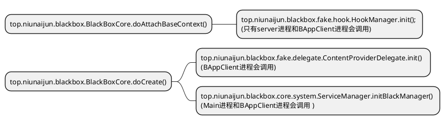

## 进程说明
应用进程分为 Server,BAppClient,Main

### Server进程
server进程与 android系统的systemserver进程类似  运行了一些自己实现的服务
进程名称 :black

### BAppClient进程
BAppClient进程 安装的应用所运行的进程
:p0 到:p50 都是BAppClient进程

### Main
主进程,主进程不会进行一些hook操作

## 初始化
Appliction:  top.niunaijun.blackboxa.app.App

### 关键方法:

## 模块说明
### android-mirror
源码反射库 https://github.com/CodingGay/BlackReflection

1.配合源码反射库生成反射源码工具类

2.定义一些aidl

### Bcore
沙盒的核心代码，都在这个模块。
#### top.niunaijun.blackbox.proxy包
代理四大组件
#### top.niunaijun.blackbox.core.system包
沙盒自己实现的ServiceManager

#### top.niunaijun.blackbox.fake包
通过动态代理替换原来实例,并实现hook。
hook初始化 top.niunaijun.blackbox.fake.hook.HookManager.init();

ActivityThread.H的handler类 拦截了CREATE_SERVICE和LAUNCH_ACTIVITY msg事件启动Hook处理  top.niunaijun.blackbox.fake.service.HCallbackProxy

